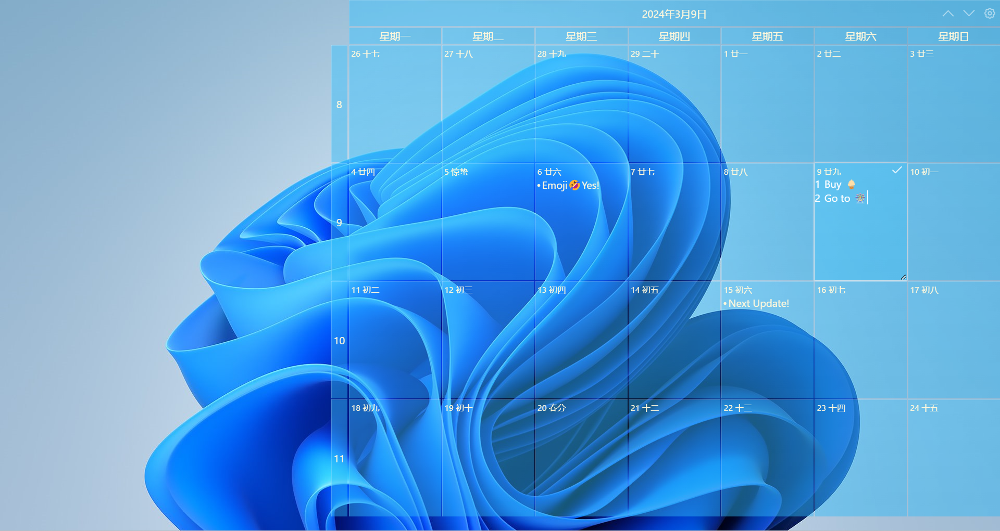

# Calendar 📅

> - A desktop calendar based on electron, inspired by [https://www.xdiarys.com/].
> - Using [https://github.com/meslzy/electron-as-wallpaper].

## TO-DOs 📃

- [x] Displaying lunar date / solar term on pages.
- [x] Editing and saving notes.
- [ ] More cofigurable things.
